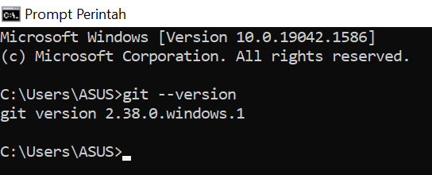
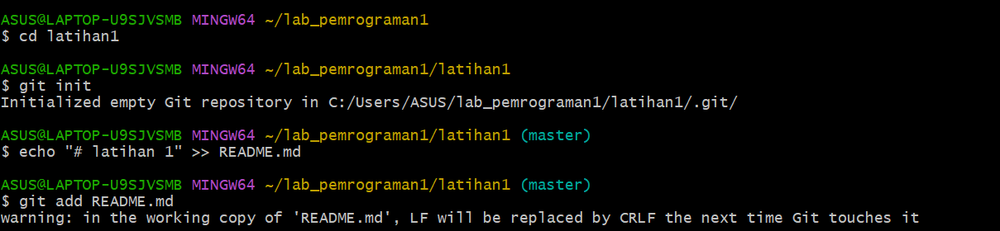
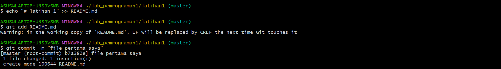
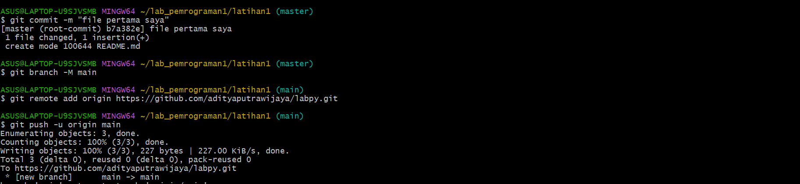
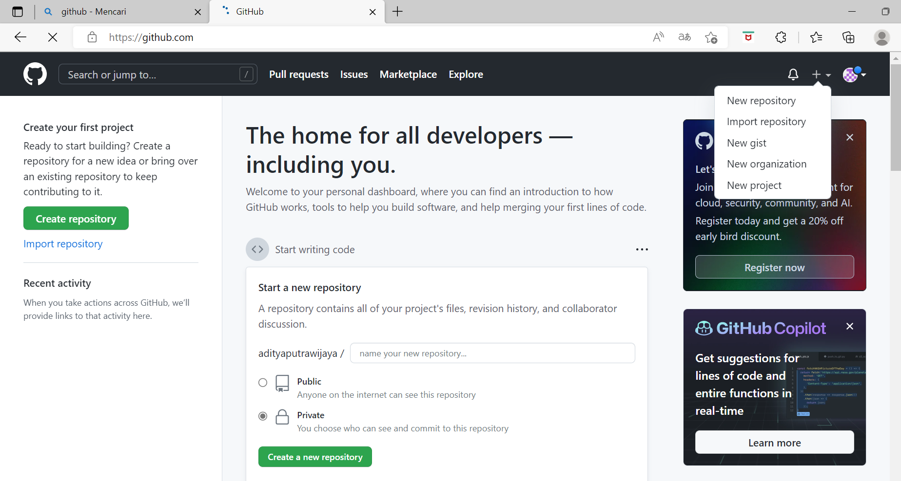
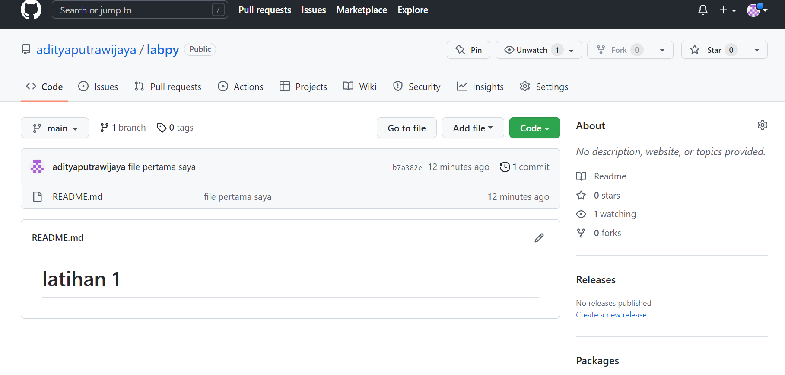
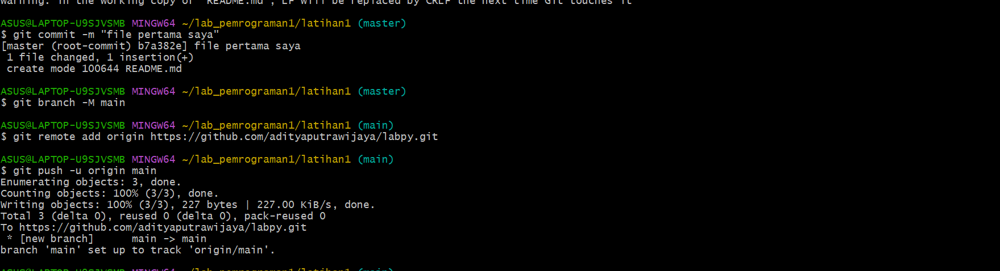
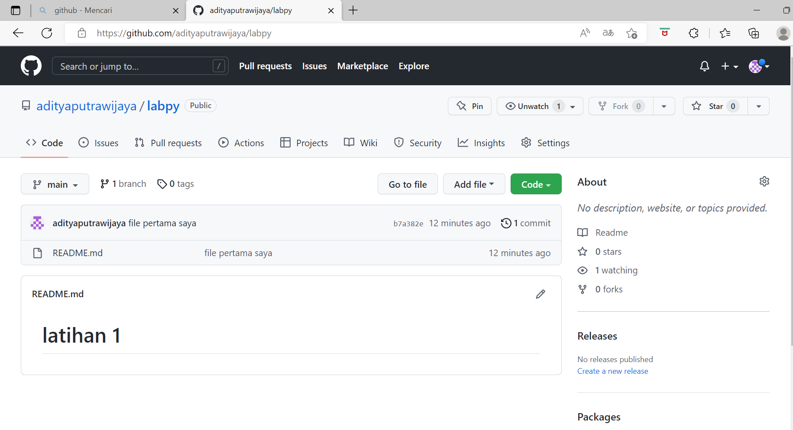
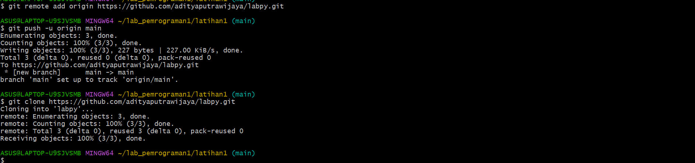

 # CARA PENGGUNAAN GIT
 
## Instalasi GIT

### - Download GIT, buka website resminya GIT  (git-scm-com).
### - Kemudian untuk GIT sesuai dengan arsitektur komputer kita. Kalau menggunakan 64bit, unduh yang 64bit. Begitu juga kalau menggunakan 32bit.
### - Selamat, GIT sudah terinstal di Windows, untuk mencobanya, silahkan buka CMD atau PowerShell, kemudian ketik perintah.
```
git --version
```


### - Pada saat pertama kali menggunakan GIT, perlu dilakukan konfigurasi *user.name* dan *user.email*
### - Konfigurasi ini bisa dilakukan untuk global repository atau individual repository
### - Apabila belum melakukan konfigurasi, akan mengakibatkan terjadinya kegagalan saat menjalankan perintah global git commit


### - Config Global Repository
```
$ git config -- global user.name "name_user"
```
```
$ git config -- global user.email "name_user"
```


## Perintah Dasar GIT


#### - git init, Perintah untuk membuat repository Lokal.
#### - git add, Perintah untuk menambah file baru, atau perubahan pada file pada staging sebelum proses commit.
#### - git commit, Perintah untuk menyimpan perubahan kedalam database git.
#### - git push -u origin master, Perintah untuk mengirim perubahan pada repository Lokal menuju server repository.
#### - git clone [ur1], Perintah untuk membuat working directory yang diambil dari repository server.
#### - git remote add origin[ur1], Perintah untuk menambahkan remote server/repositoryserver pada lokal repository (*working directory*)
#### - git pull, Perintah untuk mengambil/mendownload perubahan terbaru dari server repository ke Lokal repository.

## Membuat Repository Lokal

### - Buka directory aktif misal  : C:\User\Deskop\Lab_Pemrograman (buka menggunakan Windows Explorer)
### - Klik kanan pada directory aktif tersebut, dan pilih menu Git Bash. Sehingga muncul *git bash command*
### - Buat directory Project pratikum pertama dengan nama Latihan1
``
mkdir Latihan1
``
``
cd Latihan1
``
### - Sehingga terbentuk suatu directory baru dibawahnya, Selanjutnya masuk kedalam directory tersebut dengan perintah cd (*change directory*).
### - Directory aktif menjadi : C:\User\User\Deskop\Lab_Pemrograman\Latihan1

# Membuat Repository Lokal

### - Jalankan perintah git init, untuk membuat repository Lokal.
``
git init
``
### - Repository baru berhasil di inisialisasi, dengan terbentuknya satu directory hidden dengan nama .git
### - Pada directory tersebut, semua perubahan pada *working directory* akan disimpan.

## Menambahkan File Baru Pada Repository

#### - Untuk menambahkan file dapat menggunakan *text editor*, Lalu menyimpan filenya pada directory aktif (repository).
#### - Disini kita akan coba buat satu file bernama README.md (text file)
```
$ echo "# Latihan 1 " >> README.md
```
#### - File README.md berhasil dibuat.

#### - Untuk menambahkan file yang baru saja dibuat tersebut gunakan perintah git add.
```
$ git add README.md
```
#### - File README.md berhasil ditambahkan.



## *Commit* (Menyimpan Perubahan ke Database)

#### - Untuk menyimpan perubahan yang ada kedalam database repository Lokal, gunakan perintah git commit -m "komentar commit"
#### - Perubahan berhasil disimpan



## Membuat Repository Server

#### - Server repository yang akan kita gunakan adalah http://github.com
#### - Anda harus membuat akun terlebih dahulu 
#### - Pada laman github, klik tombol *start a project*, atau
####   dari menu (icon +) klik *New Repository*.



#### - Isi nama repositorynya, misal: labpy.
#### - Lalu klik tombol *Create repository*.



## Menambah Remote Repository

#### - Remote repository merupakan repositoryserver yang akan digunakan untuk menyimpan setiap perubahanpada lokal repository, sehingga dapat diakses oleh banyak user.
#### - Untuk menambahkan remote repository server, gunakanlah perintah
####   Git remote add origin [ur1]
```
$ git remote add https://github.com/adityaputrawijaya/labpy.git
```
## Push (Mengirim Perubahan ke Server)

### - Untuk mengirim perubahan pada lokal repository ke server gunakan perintah git push.
```
$ git push -u origin master
```
#### - Perintah ini akan memiminta memasukan *username* dan *pasword* pada akun anda di github.com



## Melihat Hasil Pada Server Repository

#### - BUka laman github.com, arahkan pada repositorynya 
#### - Maka perubahan akan terlihat pada laman tersebut




## Clone Repository

#### - Clone repository, pada dasarnya adalah meng-copy repository server dan secara otomatis membuat satu directory sesuai dengan nama repositorynya (*working directory*).
#### - Untuk melakukan cloning, gunakan perintah git clone [ur1]

```
$ git clone [https://github.com/adityaputrawijaya/labpy1.git]
```



## Kegunaan File README.md

#### - Apabila kita menggunakan github, untuk memberikan penjelasan awal pada project yang kita buat, maka dapat menggunakan sebuah file yang bernama README.md
#### - Pada file tersebut kita dapat membuat dokumentasi awal dari setiap project yang kita buat untuk memberikan penjelasan atau sekedar cara penggunaan dari aplikasi yang kita kembangkan.
#### - Penulisan file README.md berbasis teks, dan untuk pemformatannya menggunakan Markdown format.
#### - Untuk lebih jelasnya, dapat anda pelajari cara penggunaannya Markdown pada ur1 berikut: https://guides.github.com/features/mastering-markdown/

